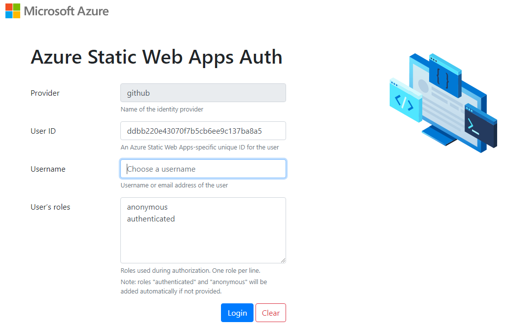
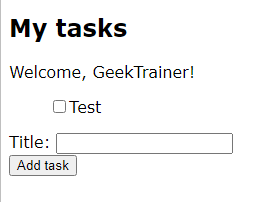

# Goal 2 - Local development

Your team should be proud! You've deployed the site to the cloud, created a database, and made the appropriate updates to get everything connected.

Of course, you typically want to develop locally rather than on a production site in the cloud. As a result, the next goal is to setup local development.

## The goal

Each member of your team will now clone the project and run it locally. You will use Git and GitHub to clone the project, install any required software, and run the appropriate scripts to start the site.

## Application notes

The template uses the [Azure Static Web Apps CLI](https://techcommunity.microsoft.com/t5/apps-on-azure/introducing-the-azure-static-web-apps-cli/ba-p/2257581?WT.mc_id=academic-28005-chrhar) to emulate Azure Static Web Apps. The Azure Static Web Apps CLI handles integration between the client and Azure Functions running locally on your system, and emulates authentication. When you run the site locally and login, you will be presented with a screen asking you to provide a user ID, username and roles. You can use whatever values you wish for testing locally.

For the local database [MongoDB In-Memory Server](https://github.com/nodkz/mongodb-memory-server) is used. This means whenever you restart the project any data in the database is removed. If you wish you can install [MongoDB](https://www.mongodb.com/try/download/community) locally and update [local.settings.json](https://docs.microsoft.com/azure/azure-functions/functions-run-local?tabs=v3%2Cwindows%2Cnode%2Cportal%2Cbash%2Ckeda&WT.mc_id=academic-28005-chrhar#local-settings) with the appropriate connection string. **PLEASE NOTE**, for purposes of this workshop, you are **NOT** required to setup MongoDB locally.

## Success criteria

Your team will have successfully completed this goal when everyone can:

- Run the project locally
- Login to the site running locally with a test account
- Create and mark tasks as complete

## Resources resources

Your team might find these resources helpful:

- [Local Setup - Static Web Apps - Mongoose starter](https://github.com/staticwebdev/mongoose-starter/blob/main/local-setup.md)
- [Azure Static Web Apps CLI](https://techcommunity.microsoft.com/t5/apps-on-azure/introducing-the-azure-static-web-apps-cli/ba-p/2257581?WT.mc_id=academic-28005-chrhar)

## Validation

To validate you have successfully setup the project locally, walk through the following steps:

1. Navigate to [http://localhost:4280](http://localhost:4280)
1. Login to the site to see the list of tasks
1. Provide a username and select **Login**
1. Ensure the username displays
1. Add a new task and select **Add task**
1. Notice the page updates with the new task

## Final result

After enabling authentication and logging in via GitHub, the page should look like this:

## Next challenge

Once your team has setup the project for local development, it's time to start [making changes](3-modify.md)!
